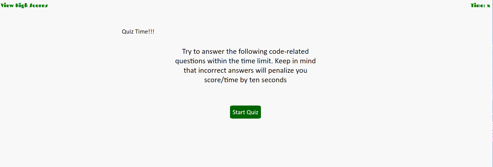

# What do you know❓

This quiz will test you on JavaScript. Once you click start you will be given a question and have multiple choice answers and you have a minuet to finish the quiz. Once you click your answer, it will show you if you are correct or wrong and then take you to the next question. If you are wrong the timer will be reduce by 10 seconds. When you are finish you will be shown your final score and you can save your initials and score.

 You can take the quiz [here](https://esmy101.github.io/What-do-you-know/).✍

